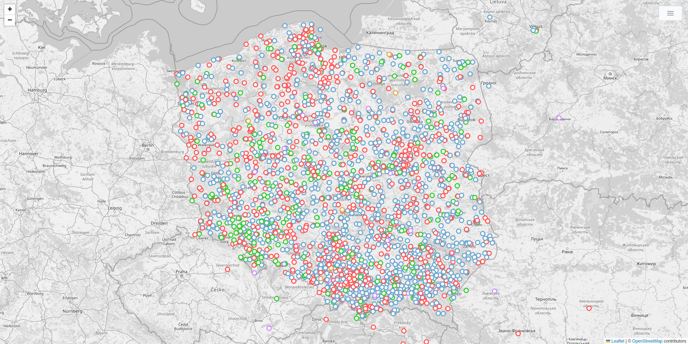

### O co chodzi?
Celem tej aplikacji jest zmapowanie wszystkich - o ile to w ogóle możliwe - miejsc związanych z Karolem Wojtyłą. Czy ponad 1000 ulic imienia papieża Jana Pawła II w naszym kraju to dużo? Czy obracający się pomnik na wyspie Guam to przesada? Czy półwysep na Antarktydzie można było nazwać jakoś inaczej? Nie mnie to oceniać. Ja tu robię tylko ciekawą mapę.



### Jak dodać lub zaktualizować pinezki?
Mapa budowana jest z mniejszych plików CSV w katalogu `resources`. Dla porządku są one posegregowane typami oraz w niektórych przypadkach województwami.

Format plików to oddzielone średnikami nazwa pinezki, miasto (lub miasto i państwo dla miejsc zagranicznych), długość i szerokość geograficzna:
```csv
name;location;longitude;latitude
# nazwa;miasto;długość geograficzna;szerokość geograficzna
```

Przykładowo:
```csv
name;location;longitude;latitude
Półwysep Jana Pawła II;Antarktyda;-62.528611;-60.766111
katamaran MV Saint John Paul II;gdzieś pomiędzy Maltą a Sycylią;36.54392761229021;13.454621290303507
Molo w Sopocie im. Jana Pawła II;Sopot;54.447778;18.576111
```

Dodać lub zaktualizować dane można poprzez pull request na platformie GitHub. Zalogowany użytkownik może to zrobić nawet przez przeglądarkę. Pull requesty będą automatycznie sprawdzane przez prosty tester walidujący semantyczną poprawność danych i dopiero po tym sprawdzane będzie ręcznie czy dane mają sens.

### Skąd pochodzą dane?
Na chwilę obecną wyłuskałem dane różnego rodzaju skryptami z wielu różnych miejsc, między innymi z:

* bazy TERYT z wszystkimi ulicami i placami w Polsce, później geokodowanych w różny sposób,
* strony [Rodzina szkół noszących imię Jana Pawła II](http://rodzina.org.pl/),
* strony [Polska-org.pl](https://polska-org.pl/7364386,Pomniki_papieskie_w_Polsce.html) z ciekawymi kategoriami takimi jak *Pomniki papieskie w Polsce*,
* strony [Waymarking](https://www.waymarking.com/),
* strony Portalu organizacji pozarządowych [Ngo.pl](https://spis.ngo.pl/?search=Jana+Paw%C5%82a+II)
* Wikipedii w różnych językach.

Podstawowa baza z pewnością nie jest pełna (szczególnie jeżeli chodzi o pomniki), ale pozwolę sobie nie publikować skryptów scrappujących, żeby nikogo nie kusiło zbierać tych danych jeszcze raz. Szkoda na to czasu i serwerów.

#### Milestony
| data                     | razem | szkoły | ulice | pomniki | kościoły | inne | komentarz                     |
|--------------------------|-------|--------|-------|---------|----------|------|-------------------------------|
| **10 października 2022** | 3008  | 1379   | 1078  | 474     | 46       | 31   | początek zbierania danych     |
| **15 października 2022** | 3587  | 1379   | 1443  | 484     | 47       | 234  | dodane NGO i zagrniczne ulice |
